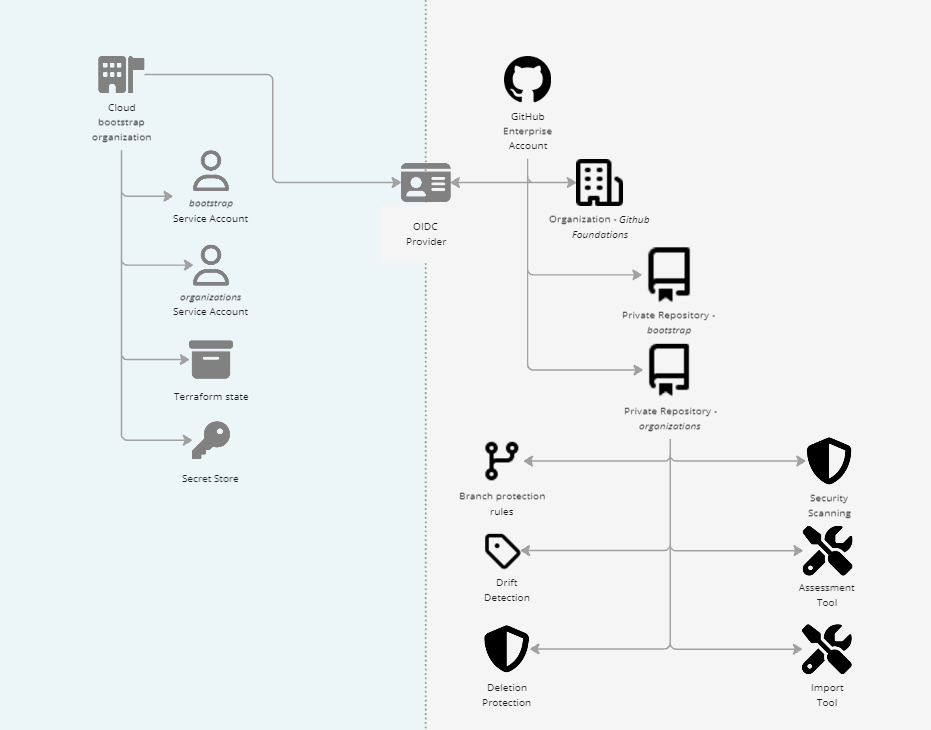

# Bootstrap

This layer of the toolkit contains all the terraform needed to:

 1. Setup a GCP or Azure project with secret management, workload federated identity for github OIDC, and a bucket for terraform state storage.
 2. Setup an organization under a github enterprise account for all the github foundation related repositories.
 3. Perform initial creation of all other organizations under a github enterprise account.

 This layer is meant to be run locally by a user that can authenticate with the `admin:enterprise, admin:org, repo, workflow` scopes.

## System Diagram



## Prerequisites for Running the Bootstrap Layer

Before running the bootstrap layer, please ensure you have the following prerequisites met:

**1. GitHub CLI:**

* Install the GitHub CLI according to your operating system's instructions ([https://cli.github.com/](https://cli.github.com/)).
* Authenticate to GitHub by running the following command: `gh auth login --scopes 'admin:enterprise','admin:org','repo','workflow'`.
  * Choose "GitHub.com" when prompted.
  * Choose your preferred protocol for Git operations.
  * Choose a method to authenticate with GitHub, when prompted.

**2. Prepare your cloud environment:**

* Github Foundations currently provides modules to setup OIDC for the following cloud providers:
    * [Azure](./AZURE_SETUP.md)
    * [Google Cloud Platform](./GCP_SETUP.md)
* If you want to use Github Foundations with a different cloud provider refer to the section [below](Running the Bootstrap Layer With An Unsupported Cloud Provider).

**Resources:**

* GitHub CLI: [https://cli.github.com/](https://cli.github.com/)

## Single Organization Setup Vs Multi-Organization Setup

The bootstrap layer can be run to setup github foundations in a single organization or in a separate organization under the same enterprise account.

A multi-organization approach allows you to configure separate policies, settings, and requirements for GitHub Foundations allowing for stricter security measures without affecting your other organizations. However this approach does require GitHub Enterprise.

The single organization approach can be used with or without GitHub Enterprise. When using this approach users should be mindful about who has access to the GitHub Foundation repositories managing their GitHub resources.

The following section will describe how to setup variables to run the bootstrap layer for both a single organization and a multi-organization setup.

### Azure Setup (Optional)

If you are using Azure as your cloud provider, you will need to setup the Azure terraform files.

1. Delete each of these files to:
    * `main.tf.gcp`
    * `providers.tf.gcp`
    * `versions.tf.gcp`
    They are GCP configuration, and not needed for Azure.
3. Copy the `azure/main.tf.azure` file into the root of the repository and rename it to `main.tf`.
4. Copy the `azure/providers.tf.azure` file into the root of the repository and rename it to `providers.tf`.
5. Copy the `azure/versions.tf.azure` file into the root of the repository and rename it to `versions.tf`.
6. Copy the `azure/variables-override.tf.azure` file into the root of the repository and rename it to `variables-override.tf`.


### Configuring Variables

Before running the bootstrap layer, you need to configure input variables for it to run. You can do this by copying the `terraform.tfvars.example` file to `terraform.tfvars` and filling in the values.

```bash
$ cp terraform.tfvars.example terraform.tfvars
$ nano terraform.tfvars
```

For both a single organization and multi organization approach the following variables are required:
- `org_id`: The id of the gcp organization that will have the project that has the terraform state file bucket(s).
- `billing_account`: The billing account to use for the gcp project that has teh terraform state file bucket(s).
- `github_foundations_organization_name`: The name of the organization that will host the github foundation repositories. In the case of the multi-org approach this must be an organization name that doesn't already exist. However for the single org approach this should be the name of an existing organization that you want to use.

To use the toolkit in a multi-organization approach the following variables are required in addition to the previous:
- `github_enterprise_slug`: The slug of the enterprise account that own your organization(s).
- `github_organization_admin_logins`: A list of github users that will be given admin permissions to the github foundation organization.
- `github_organization_billing_email`: A email for billing to set in the github foundation organization.

For the multi-organization approach the following variable is optional:
- `github_enterprise_organizations`: A map of organizations to create under the enterprise account. You can still use the organization layer to manage organizations under your enterprise account that weren't created this way so this is optional.

For any configuration the following are optional:
- `tf_state_bucket_name`: The name of the bucket to store the terraform state file. If not set a default name will be used.
- `tf_state_location`: The location of the bucket to store the terraform state file. If not set a default location will be used.

For any configuration, using `Azure` as the cloud provider, the following are optional:
- `secret_store_name`: The name to use for a secret manager store. To bring your own Azure Key Vault, specify the name of the Azure Key Vault you want to use. If not set, a new Azure Key Vault will be created using a default name.
- `secret_store_project`: The container / project name where the secrets will be stored. If not set a default name will be used.


## Running the Bootstrap Layer

This section outlines the steps to run the bootstrap layer. Remember to ensure you have met the prerequisites detailed in the previous section before proceeding.

### Running the Bootstrap Layer

To run the bootstrap layer perform the following steps:

1. Clone this repository locally and copy the bootstrap folder into a separate folder on your local machine.
2. Navigate to the folder that you copied the bootstrap layer to and configure the variables required to run it. For more info on how to do this refer to the [configuring variables section](#configuring-variables).
3. Run `terraform init` then generate and execute a plan with `terraform apply`. If you run into any authentication issues make sure all [prerequisites are met](#prerequisites-for-running-the-bootstrap-layer).
      * If using `Azure` for your backend, make a note of the `sa_name` output as you will need it for the next step.

4. After a successful application of the terraform code navigate to the `backend.tf` file and uncomment the backend configuration for your cloud.

---

**GCP**

It should be the block that looks like this:
```hcl
terraform {
  backend "gcs" {
    bucket = "ghf-state-1234567890"
    prefix = "terraform/github-foundations/bootstrap"
  }
}
```
* replace the bucket name with the one you set in the `terraform.tfvars` file, or the default one (`ghf-state-<your-org-id>`) if you didn't set it.

---

**Azure**

It should be the block that looks like this:
```hcl
terraform {
 backend "azurerm" {
   resource_group_name  = "github-foundations"
   storage_account_name = "ghfoundations"
   container_name       = "ghf-state"
   key                  = "prod.terraform.tfstate"
 }
}
```
  * replace the `container_name` with the one you set in the `terraform.tfvars` file, or the default one (`ghf-state-`) if you didn't set it.
  * replace the `storage_account_name` with the name of the `sa_name` output from the previous step.

---

5. Run `terraform init -migrate-state` again, it should ask you if you want to migrate your backend. If you want to suppress the prompt and answer "yes" then add the `-force-copy` option.
6. Create a pull request and store all the bootstrap layer terraform in to the bootstrap repository that should have been created for you by terraform when you ran `terraform apply`.

After performing these steps your bootstrap layer should have setup GCP OIDC, Github secrets and variables for the OIDC connection, Github repositories for your terraform code to live in, and state file in a GCP bucket containing the state of the bootstrap layer.

### Running the Bootstrap Layer With An Unsupported Cloud Provider

Currently the only cloud provider Github Foundations has out of the box support for is Google Cloud Platform. To use Github Foundations with a different cloud provider please refer to the [custom cloud setup documentation](./CUSTOM_CLOUD_SETUP.md)

### Generating a Plan (Without Execution)

To generate a plan that outlines the changes the bootstrap layer will make to your infrastructure, without actually executing them, run the following command:

```
terraform plan
```

This command will analyze your Terraform configuration and display a detailed plan summarizing the planned changes:

* Resources to be created, updated, or destroyed.
* Any potential costs associated with the changes.
* Any potential warnings or errors.

Carefully review the plan to ensure it aligns with your expectations before proceeding to the next step.

### Generating and Executing a Plan

To generate a plan and immediately execute the changes in your infrastructure, run the following command:

```
terraform apply
```

**Warning:** This command will make irreversible changes to your infrastructure. Before running it, ensure you have thoroughly reviewed the plan generated by `terraform plan` and understand the potential impact of the changes.

By default, `terraform apply` will prompt you for confirmation before executing the plan. You can bypass this prompt and proceed directly with execution by using the `-auto-approve` flag, but **strongly advise against** doing so in production environments due to the risk of unintended consequences.

**Additional Options:**

* For more granular control over the plan generation and execution process, you can explore additional options supported by the `terraform plan` and `terraform apply` commands. Refer to the official Terraform documentation for a comprehensive list of options: [https://developer.hashicorp.com/terraform](https://developer.hashicorp.com/terraform)

**Important Note:** Remember to exercise caution when working with tools that modify your infrastructure. Always have a backup plan and a clear understanding of the potential consequences before executing any changes.
