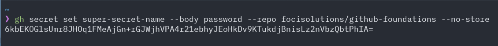

## Encrypting Secret Values Using GitHub CLI

To set a secret in a GitHub repository or organization without storing the secret value in the GitHub server, you can use the `gh secret set` command.

1. **Setting a secret for a repository:**

```shell
gh secret set SECRET_NAME --body "secret_value" --repo owner/repo --no-store
```

- Replace `SECRET_NAME` with the name you want to give your secret.
- Replace `"secret_value"` with the actual value of your secret.
- Replace `owner/repo` with the appropriate repository owner and repository name.

You will be provided an encrypted output as shown in the image below.


2. **Setting a secret for an organization:**

```shell
gh secret set SECRET_NAME --body "secret_value" --org organization --no-store
```

- Replace `SECRET_NAME` with the name you wish to assign to your secret.
- Replace `"secret_value"` with the actual value of your secret.
- Replace `organization` with the name of your GitHub organization.

### Notes on `--no-store` Option

- The `--no-store` option ensures that the secret's value is not stored or logged anywhere on the GitHub server, providing an additional layer of security.
- It's essential to replace `"secret_value"` with the actual value you wish to encrypt and use as a secret. This value is encrypted client-side and securely transmitted to GitHub.

## Conclusion

Using the GitHub CLI with the `--no-store` option for setting secrets is a secure and straightforward method for managing sensitive values in your projects. By integrating these encrypted secrets into your Terraform configurations, you maintain a high level of security and best practices for infrastructure as code.